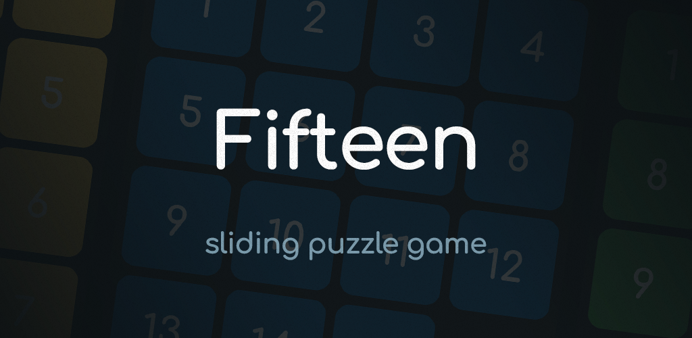
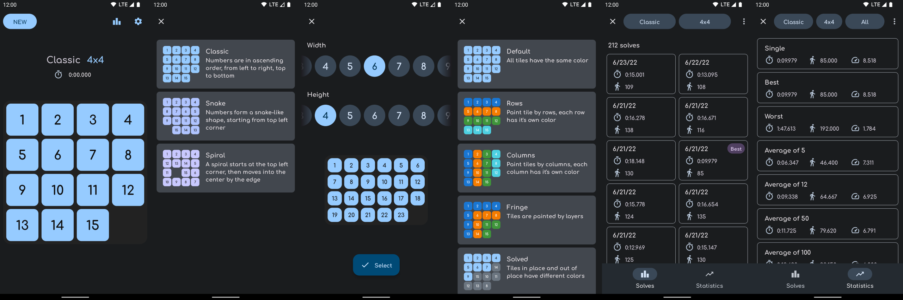

# Fifteen  

## Features

* Game types: classic, snake, spiral
* Game sizes: anything from 3x3 to 10x10
* Custom tile colors and schemes: by rows, columns, fringe, solved
* Convinient controls: slide, click or hover
* Normal and hard modes
* History of solves and statistics
* Solution recording
* Random missing tile mode

## Screenshots

### Light theme

### Dark theme

## Downloads

APKs can be found at [releases](https://github.com/italankin/fifteen-releases/releases).

You can also download the app directly from [Google Play](https://play.google.com/store/apps/details?id=com.italankin.fifteen2).

## Changelog

See [CHANGELOG.md](./CHANGELOG.md)
